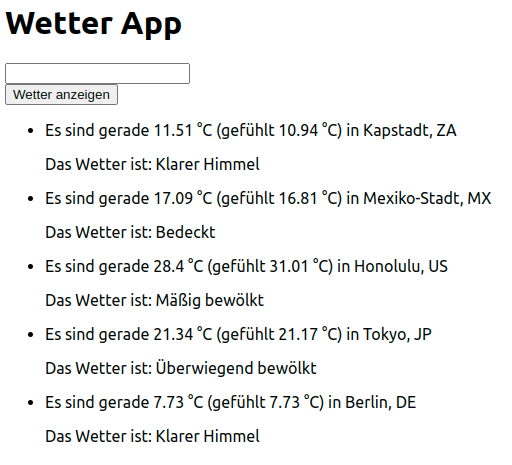

# Wetter-App mit React

Verwende die API [OpenWeather](https://openweathermap.org/current) und baue eine Webseite, mit der man das Wetter abfragen kann.

## Vorbereitung

- Falls du noch keinen API-Key hast, erstelle ein Account auf [OpenWeather](https://openweathermap.org). Du sollst deinen eigenen API-Key benutzen.
- Mache ein paar API-Abfragen in Thunder Client oder in einem anderen Tool. Teste unterschiedliche Abfragen und schaue dir die Antworten des Servers an.

## Aufgaben

- Auf der Webseite soll mindestens ein Input für eine Stadt und ein Button mit dem Text "Wetter anzeigen" vorhanden sein. Wenn ein Nutzer eine Stadt eingegeben hat und auf den Button klickt, soll auf der Seite ein Text mit dem Wetter erscheinen.
  
  Beispiel:

      Es sind gerade 7.73 °C (gefühlt 7.73 °C) in Berlin, DE  
      Das Wetter ist: Klarer Himmel

- Erweitere die Seite, so dass sie die Ergebnisse der letzten fünf Abfragen (in einer Liste) anzeigt. Wird eine neue Abfrage gemacht, wird die älteste Abfrage nicht mehr angezeigt.
- Die Seite soll die neueste Abfrage als erste anzeigen.
- (Speichere die Ergebnisse der Abfragen in localStorage und zeige sie an, wenn die Seite neu geladen wird.) wird morgen nachgeholt.
- Style die Seite so wie es dir gefällt!

Beispiel:

## Bonus

- Füge eine Option ein, womit der Nutzer eine Vorschau für die nächsten 5 Tage bekommen kann.
- Füge weiter Funktionalitäten hinzu, z.B.
  - weitere Wetter-Daten holen
  - eine passende Animation zu jedem Wetter auf der Seite anzeigen.
- Benutze die [Geocoding API](https://openweathermap.org/api/geocoding-api), um aus Städten, die denselben Namen haben, eine auszusuchen und die Wetterdaten davon zu bekommen. (recht umfangreich)

## Regeln

- Verwende **git** um die Zwischenstufen zu speichern.

# Weather app with React

Use the API [OpenWeather](https://openweathermap.org/current) and build a web page to query the weather.

## Preparation

- If you don't have an API key yet, create an account on [OpenWeather](https://openweathermap.org). You should use your own API key.
- Make a few API queries in Thunder Client or in another tool. Test different queries and look at the server responses.

## Tasks

- On the web page there should be at least one input for a city and a button with the text "Show weather". When a user has entered a city and clicks on the button, a text with the weather should appear on the page.
  
  Example:

      It is currently 7.73 °C (felt 7.73 °C) in Berlin, DE.  
      The weather is: Clear sky

- Expand the page so that it shows the results of the last five queries (in a list). When a new query is made, the oldest query is no longer displayed.
- The page should display the newest query first.
- (Store the results of the queries in localStorage and show them when the page is reloaded) will be done tomorrow.
- Style the page the way you like it!

Example:

## Bonus

- Add an option where the user can get a preview for the next 5 days.
- Add further functionalities, e.g.
  - get more weather data
  - show an appropriate animation for each weather on the page.
- Use the [Geocoding API](https://openweathermap.org/api/geocoding-api) to select one of the cities with the same name and get the weather data from it. (quite extensive)

## rules

- Use **git** to save the intermediate levels.

Translated with www.DeepL.com/Translator (free version)

